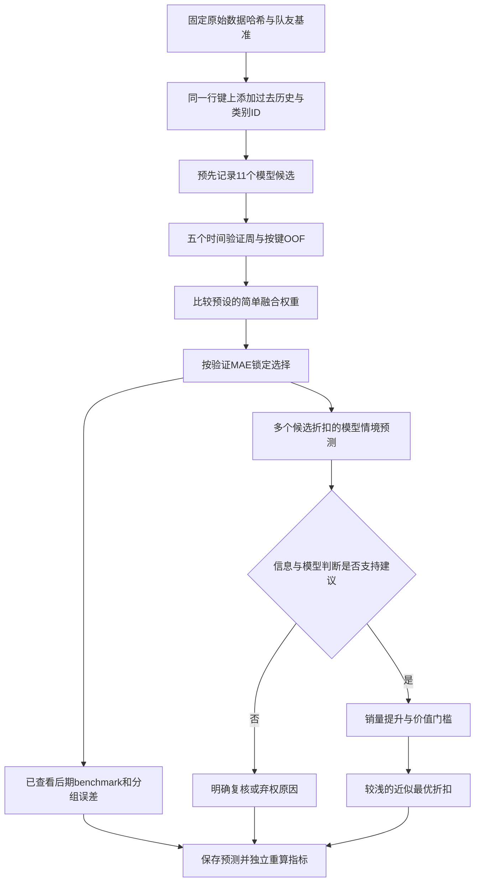

# Lisa 的 V2 pipeline：自己的思路、代码与实际结果

第一次了解项目，建议先读 [中文故事与答辩说明](PROJECT_STORY_ZH.md) 和 [英文故事版 notebook](../02_lisa_pipeline.ipynb)：正文从经理的问题、公开数据和五家门店的筛选讲起，再展开各模型的调查、控制变量实验、具体折扣与失败案例。本指南保留为核心源码逐行阅读的配套材料。主实验结果和赢家保持不变；后续新增的35次验证期消融拟合与10组规则敏感性检查另存于 `results/story_ablation/` 和 `results/story_diagnostics/`，并未用来改选模型或规则。

这份指南解释 `src/finalproject_pricingml/v2.py` 和 `results/v2/` 的已完成运行。队友原版的逐行说明另见 [TEAMMATE_CODE_WALKTHROUGH_ZH.md](TEAMMATE_CODE_WALKTHROUGH_ZH.md)。本文中的结果读取自本次V2保存文件，教学解释不会伪装成新实验。运行回执记录66次模型拟合、10,920条OOF预测、2,184条后期基准预测和2,184条推荐/复核记录。

本文行号对应阅读时的V2源码（`run`函数位于403行），后续编辑可能移动行号。运行证据以 `experiment_plan.json → selection.json → comparison.csv → run_receipt.json` 为准。本版本仍使用已经查看过的历史基准周，不是全新、从未见过的外部测试。可直接打开[源码](../src/finalproject_pricingml/v2.py)，重点读[特征](../src/finalproject_pricingml/v2.py#L98)、[验证](../src/finalproject_pricingml/v2.py#L171)和[推荐逻辑](../src/finalproject_pricingml/v2.py#L285)。

## 1. 用自己的逻辑把任务拆成五个问题

1. **我要预测什么？** 给定某店某商品的历史信息与明天折扣，预测下一天实际记录的标准化销量。
2. **我怎样知道模型值得使用？** 用相同的日期、样本、baseline和主要指标，比较多个模型；先用时间验证选择，再报告已查看的后期benchmark。
3. **我是否有足够依据建议折扣？** 昨天缺货、没有满价参照、历史折扣样本少、模型明显分歧时，先给“复核/暂不建议”。
4. **若条件允许，折多少？** 比较历史支持的候选，要求预测销量至少增加5%、价值代理至少保留95%，在销量近似最优的候选中选较浅折扣。
5. **这套流程证明了什么？** 可以证明某些预测误差与输出检查结果；还没有观察新策略真实施行后的利润或浪费变化。

“是否建议”与“建议哪个折扣”在这里明确拆开。第一阶段是数据充分性与规则检查，不是训练了一个“打折/不打折”的分类器。最后可能返回折扣、满价、复核或弃权；**复核不等于建议满价**。

## 2. 结果先说清楚：为什么最终是25% RF + 75% 新CatBoost

锁定的预测器为：

\[
\hat y_{V2}(x)=0.25\hat y_{RF}(x)+0.75\hat y_{CB,\ history+IDs,\ MAE}(x).
\]

两个成员各自训练，输出同一个目标的标准化销量，再做加权平均。不是RF先给CatBoost输入，也不是把两个模型的参数平均。

以下来自同一V2运行的 [comparison.csv](../results/v2/comparison.csv)，可直接公平比较；用这个run中的队友参数重跑结果作为参照，而不是混用另一台机器的旧结果：

| 方案 | 5周平均验证MAE↓ | 后期benchmark MAE↓ | 后期RMSE↓ |
|---|---:|---:|---:|
| 7日均值 baseline | 0.328397 | 0.314185 | 0.520890 |
| 同星期上周 baseline | 0.415021 | 0.399753 | 0.617069 |
| Ridge | 0.315529 | 0.307252 | 0.502804 |
| Decision tree | 0.323589 | 0.322223 | 0.498684 |
| HistGradientBoosting | 0.305848 | 0.290059 | 0.456923 |
| kNN reference | 0.311976 | 0.303985 | 0.490022 |
| 队友 RF | 0.302436 | 0.292348 | 0.464595 |
| 队友 CatBoost | 0.303303 | 0.289649 | 0.460264 |
| 原main参数 CatBoost（本run重跑） | 0.303545 | 0.287542 | 0.451102 |
| 基础10特征 CatBoost MAE | 0.302734 | 0.288440 | 0.464590 |
| CatBoost history + IDs，RMSE损失 | 0.297152 | 0.284230 | 0.455004 |
| CatBoost history + IDs，MAE损失 | 0.294495 | 0.284578 | 0.460059 |
| Monotonic HistGBR | 0.305976 | 0.290297 | 0.456547 |
| 队友50/50融合 | 0.301253 | 0.289232 | 0.459262 |
| **V2 RF25% + 最佳单模型75%** | **0.294019** | **0.283389** | **0.456051** |
| RF50% + 最佳单模型50% | 0.295305 | 0.284247 | 0.455476 |
| RF75% + 最佳单模型25% | 0.298137 | 0.287138 | 0.458345 |

选择依据是验证MAE最低，选择在本次后期评分前写入 [selection.json](../results/v2/selection.json)。相对同次运行队友50/50，验证MAE降低约2.40%，后期MAE降低约2.02%；相对7日均值，后期MAE降低约9.80%。这表示本次探索性预测评价有改善，**不是利润增加2.02%，也不表示所有指标均最好**。例如原main参数CatBoost后期RMSE低于V2；这没有改变预定的MAE选择标准。

同一特征和参数下，history+IDs的RMSE/MAE损失两版构成一个较清楚的损失函数对照：MAE训练损失的验证MAE较低，但其后期RMSE较高。基础10特征版与history+IDs版还同时改变了历史/ID和正则强度，不能把两者全部差额单独归因于某一个新特征。

25/75只是在预设的少量权重中获胜，不能说成全局最优权重。选择简单融合是为了让成员、权重、输入与证据容易解释，并避免为小样本再训练复杂stacking元模型；不是证明stacking一定无效。

**跨城市压力检查没有保持改善。** 冻结选择后，另取100条系列，覆盖16个其他城市、93家新店，评估同一7天共700行；模型仍只在原312系列训练，没有用新系列target重新fit，也没有因新结果改赢家。新系列先前已观察销量可以用来计算历史输入，所以它也不是“完全没有历史的新商品冷启动”。结果见 [results/v2_transfer/summary.csv](../results/v2_transfer/summary.csv)：

| 跨城市压力检查 | MAE↓ | RMSE↓ |
|---|---:|---:|
| 7日均值 | 0.296668 | 0.483557 |
| 队友50/50 | **0.288419** | **0.470964** |
| Lisa V2 | 0.289017 | 0.488632 |

因此结论应是：“V2在原cohort的历史评价中改善MAE，但跨城市迁移检查没有胜过队友版本。”类别ID可能帮助拟合现有店商品的特征，也可能使跨店泛化困难；本结果只说明边界，不能单独证明ID就是退步原因。移除ID保持其他因素相同的对照才可以进一步判断。这个压力检查也未被称为全项目从未看过的全新holdout。

## 3. `v2.py`代码地图

下文省略共同前缀，`V:行号`都指 `src/finalproject_pricingml/v2.py`。函数内部按小逻辑块解释全部可执行部分。

### 3.1 基础工具、预设模型与统一预测接口

| 位置 | 做什么 | 为什么这样做 |
|---|---|---|
| V:6–26 | 导入哈希、JSON、环境、时间、表格、模型与线程限制；复用队友config/data/models。 | 新版本独立扩展，不覆盖队友实现；便于追溯差异。 |
| V:28–33 | 指定results/v2目录；8个额外数值特征、2个ID特征；固定train/eval的SHA-256。 | 相同文件名不保证相同数据，哈希约束原始输入。 |
| V:36–41 | 每次读1MiB更新SHA-256，返回整个文件摘要。 | 不必把大型数据文件一次全读到内存。 |
| V:44–46 | 创建父目录并输出UTF-8 JSON，保留中文及可读缩进。 | 将计划、选择与核验结果存为机器可读证据。 |
| V:49–68 | 返回11种候选的声明列表。 | 没有读test后自动反复调网格；本轮只跑记录下来的候选。之前已看过历史benchmark的事实仍须披露。 |
| V:71–72 | history_ids取10+8+2=20输入，其他取基础10个。 | 每模型输入范围明确，能追踪特征增益和比较限制。 |
| V:75–80 | 根据kind创建Ridge+Scaler或单棵回归树。 | Ridge需要尺度处理；树不用。所有factory返回未训练实例。 |
| V:81–84 | 建HistGBR；固定lr.05、300迭代、15叶、正则；关闭自动early-stopping；可对discount_next设−1单调约束。 | 关闭内部随机验证便于保持显式时间协议；−1意味着支付比例越高，销量预测不能上升，方向别写反。 |
| V:85–89 | kNN取25邻居；RF固定队友300树、depth10、leaf3、半特征；都限4线程。 | 给队友方法公平重跑参照，限制机器资源。 |
| V:90–95 | CatBoost从spec读取深度/迭代/lr/loss/l2；history_ids版声明cat_features；未知kind报错。 | 显式参数避免裸工厂默认值与报告参数不一致。 |
| V:131–137 | 转array、检查长度和有限值，然后算MAE/RMSE/WAPE/n。 | 防止NaN或长度不一致悄悄产生分数。索引语义对齐仍须在调用前按键完成；长度相同不等于同一行。 |
| V:140–142 | 按对应spec取列预测，并将负销量裁为0。 | 所有估计器共用预先声明的物理后处理；尤其线性模型可能预测负数。 |

`IDS=["store_category","product_category"]`只是代码名，实际内容是store_id/product_id转成字符串；它们**不是**FreshRetail原有商品品类层级。CatBoost可用这些类别标识学习店/商品的稳定差异；它也可能记住现有店商品，因此当前结果不能直接推广成新店/新SKU效果。

主候选保留我们的Ridge、DecisionTree、RF、HistGBR、CatBoost模型家族，额外加入队友kNN参照和受控CatBoost/单调变化。模型种类多不是亮点本身；有明确问题的对照更重要。

### 3.2 新特征怎样构造，为什么没有直接读未来销量

| 位置 | 实际计算 | 解读 |
|---|---|---|
| V:98–106 | 读取选中系列原始train/eval的键、销量、折扣，合并keys并检查many-to-one，按系列日期排序。 | 同一系列才能衔接历史，merge cardinality明确。 |
| V:107–109 | 折扣不在`(0,1]`的行，对新增历史把销量/折扣设NaN。 | 新历史不把异常原价比例重新解释成真实价格；基础features仍沿用队友清洗协议，所以两种清洗应如实记录。 |
| V:110–113 | 分组；初始化键；销量shift2、shift3。 | 帮助捕捉前两/三天结构，目标日销量没有进入。 |
| V:114 | shift1后rolling3均值，至少1个有效历史值。 | 短期水平。不是要求每行都有3个完整有效日。 |
| V:115 | shift1后rolling14均值，至少1个有效值。 | 更长时间尺度；保留原benchmark行，不因新14天窗口删掉更多开头样本。 |
| V:116 | shift1后rolling7标准差，至少2个有效值。 | 最近波动。pandas默认样本标准差分母n−1。 |
| V:117 | 过去7天折扣均值。 | 记录近期促销环境，与今天折扣互补。 |
| V:118 | 把新增历史按ROW_KEY左连接到原feat，validate one-to-one。 | 不依赖行位置，也不改变原评价人群。 |
| V:119–122 | 新销量lag/均值若缺失用该行历史均值补；std缺失用0；历史折扣均值缺失用昨日折扣。 | 这些回退只依赖已存在的过去信息。不是用全数据均值填充。 |
| V:123 | `sales_trend = sales_mean3 − sales_mean7`。 | 最近3日高于最近7日则为正，表示短期向上趋势的描述，不能称已知明日增长。 |
| V:124–125 | 店铺、产品ID转字符串作为类别列。 | 防止模型把ID18和ID343当作有量纲距离。 |
| V:126–128 | 检查行数没变、行键不重复、全部20输入无缺失，返回增强表。 | 数据表的完整性先于模型得分。 |

八个额外数值输入包括原表已有但未被默认模型使用的`stockout_days7`。因此是“比原模型多8个数值输入”，并非8列都在本函数第一次创建。

举一个只为理解特征的例子：过去7日销量`[.8,1,1.2,.9,1.1,1.3,.7]`的7日均值为1，最近3日均值约1.0333，trend约+.0333；lag2=1.3，lag3=1.1。仍必须由当天之前的值计算。实际训练数据来自原始公共文件，未用此例生成训练样本。

### 3.3 在训练前留证据：prepare

| 位置 | 解释 |
|---|---|
| V:145–149 | 创建输出目录、计算两个原文件哈希，不符预设即停止。 |
| V:150–151 | 强制重建队友基础features，添加V2输入，保存本次features.parquet。不是继续信任旧缓存。 |
| V:153–156 | 在计划中记运行时间、队友SHA、raw/feature/code哈希、11候选与时间切分。 |
| V:157–164 | 记录选择规则、融合规则、已看过test/回顾性cohort/rolling-next-day解释，以及决策阈值。 |
| V:165–168 | 记录Python与库版本，写experiment_plan，再返回feat/plan。 |

数据哈希证明输入文件身份，不证明数据没有业务偏差。代码哈希证明哪个源码版本对应计划，不能只靠它断定运行结果正确；因此后面还保存逐行预测并重算误差。

### 3.4 时间验证、按键OOF与选择

| 位置 | 解释 |
|---|---|
| V:171–175 | 只取test_start之前；取有验证fold行；用ROW_KEY作为OOF索引，保存fold和target。 |
| V:176–178 | 初始化计时记录，把两个baseline预测按相同行键放进OOF。 |
| V:179–183 | 每候选、每周分别取之前训练与该周检查行；断言train截止早于val，验证每周2,184行。 |
| V:184–187 | 临时限制数值库线程、fit、predict、把预测和该行键一起保存。11候选×5fold=55次拟合。 |
| V:188–190 | 拼每折预测；检查键唯一与预期键覆盖；按OOF键reindex。 |
| V:191–194 | 记录耗时，打印5周等权MAE，每完成一个候选就保存OOF进展。 |
| V:195–197 | 在非RF单模型候选中，选CV MAE最低的一个作新融合搭档。这样不会做RF与RF的无效融合。 |
| V:198–201 | 保留队友RF/Cat50-50，另外只试RF占25/50/75%的三种预先声明权重。 |
| V:202–203 | 对已保存的OOF列线性加权；不必为每个权重重新fit。 |
| V:204–211 | 对2baseline+11单模型+4blend共17方案逐fold计算指标，汇总CV均值和周间标准差。validation_rmse是5个周RMSE的平均，不是把所有周误差先合并后再开方。 |
| V:212–217 | 找验证MAE最低方案，记录最终权重、选择时间与plan哈希；注明仍为探索性历史选择。 |
| V:218–223 | 保存OOF预测、每折分数、摘要、耗时和selection JSON。 |

本次获得的新最佳单模型是`CatBoost history + IDs MAE`，进一步25/75组合的验证MAE略低。基准候选也参加最终排名；设计允许简单baseline获胜时就选baseline，而不是规定复杂模型必须赢。

**边界仍然在：** 这次运行在后期评分前锁了选择，改善了本轮顺序；但整个项目已经看过那周数据，所以不能把“本轮先锁定”说成“全项目从未见过该周”。特征和损失选择继续复用五个验证周，也存在探索选择乐观偏差。

### 3.5 后期共同benchmark、误差切片与bootstrap

| 位置 | 解释 |
|---|---|
| V:226–230 | 分训练/后期表，保留行键、target、实际折扣、事后缺货诊断，加入两个baseline。 |
| V:231–236 | 11候选各在完整训练期fit一次并预测，保存fitted模型和spec。总拟合55+11=66次。 |
| V:237–243 | 按已冻结权重融合；算后期指标；与CV摘要one-to-one合并，标selected。 |
| V:244–245 | 保存comparison.csv、逐行test_predictions.csv。 |
| V:246–257 | 按日期、门店、折扣档、目标日是否缺货比较baseline/队友blend/V2。目标日缺货只供事后诊断，没有作为预测输入。 |
| V:258–259 | 保存V2绝对误差最大的12个案例。 |
| V:262–263 | 每行算V2绝对误差−队友blend绝对误差，再按店铺商品平均7日。负数表示V2误差更小。 |
| V:264–268 | 固定随机种子，在312个系列均值中有放回抽样2,000次，取差值均值分布的2.5/97.5分位。 |
| V:269 | 返回fitted与test，后面用于场景。 |

保存的差值为−0.005843，按系列重抽样的95%区间约`[−0.010105, −0.001127]`。它保留同系列7天成块，比把每行当独立更合理；但没有完全处理同门店共同冲击、只有5家店、只7天、重复选择偏差。可报告为描述性配对分析，不能升级为充分的外部有效性证明。

### 3.6 怎样调用最终预测器

| 位置 | 解释 |
|---|---|
| V:272–276 | 如果selected是blend，根据已冻结成员与权重，各按自己的特征spec预测并相加。RF只用10列，新Cat用20列。 |
| V:277–280 | 如果baseline获胜，直接返回对应历史均值/同星期销量。 |
| V:281–282 | 如果普通单模型获胜，取其模型与spec预测。 |

同一个推荐场景里两模型特征数不同不是错误：它们的输出目标相同且对同一行预测，才可以融合。重要的是每个成员使用训练时相同的输入定义与列名。

## 4. 决策层每一步：可以说“不知道”

设候选支付比例为d，最终模型预测为`q̂(d)`，满价预测为`q̂(1)`。代码计算：

\[
g(d)=\frac{\hat q(d)}{\hat q(1)}-1,\qquad
v(d)=\frac{d\hat q(d)}{\hat q(1)}.
\]

要求`g(d)≥.05`且`v(d)≥.95`。g是相对满价的**预测销量增幅**；v是相对满价的**标准化销量×支付比例代理**。同一行同一商品的未知固定尺度可以在比值中抵消，但不因此获得真实货币收入、利润、临期损耗或因果效应。

| 位置 | 代码动作 | 对用户应怎样解释 |
|---|---|---|
| V:285–289 | 默认结果为abstain_support，折扣与预测字段NaN。 | 默认未形成建议，不能把缺值显示成0折或满价。 |
| V:290–291 | 昨日缺货小时≥1，返回review_stockout。 | 记录销量可能受供货限制，应核实明日供给；不宣称明日全部新鲜，也不直接禁止折扣。 |
| V:292–293 | 任何情境预测不是有限数字则复核。 | 算法状态错误不能变成业务建议。 |
| V:294–299 | 必须有历史支持的满价行，各参照模型满价销量须>0。 | 无参照或分母0，无法稳定计算相对增幅。 |
| V:300–302 | 只留有至少3个附近历史日的折扣候选；没有就弃权。 | 不是“满价最好”，而是折扣证据不足。 |
| V:303–305 | 算g与v，用最终模型检查5%增幅/95%价值门槛。 | 门槛是预设决策偏好，没有因果或利润保证。 |
| V:307–312 | 同一候选还需队友RF和队友CatBoost都满足同样门槛。 | 多模型敏感性检查，不是三张独立选票；模型共享数据且有相关性。 |
| V:313–315 | 最终模型有可行候选，但参照模型不支持，返回review_model_disagreement。 | 应人工复核，不强选一个折扣。 |
| V:316–318 | 有支持可比较，却没有任何候选满足最终模型门槛，返回keep_full_price。 | 这才是形成了“不打折”的模型规则建议。 |
| V:319–321 | 在通过所有检查的候选里找最高q̂；允许低于该最高值最多1%，然后取支付比例最大的。 | 预测差异非常小时优先少让价，避免追逐不可靠的小数差异。 |
| V:322–325 | 返回recommend_discount、折扣、预测、g、v、原因。 | 输出可解释，并可审计门槛。 |

“1%近似最优”与“5%销量增幅”不是一回事：5%相对于满价，决定是否值得考虑；1%相对于可行候选中最好预测，决定是否能用更浅折扣换取几乎相同预测销量。两者都是规则参数，不是统计显著性阈值。

`stockout_days7`在新CatBoost里是历史特征；代码没有把“7天没缺货”直接解释成库存年龄，也没有强制这类商品打折。这比队友规则更忠于当前可观察信息。

### 4.1 对全部2,184行形成完整输出

| 位置 | 解释 |
|---|---|
| V:328–335 | 分train/test，读取plan中的decision_parameters；对8个候选复制目标行，只替换discount_next。 |
| V:336–339 | 训练期按店铺商品统计折扣在配置宽度±.025内的日数，用配置的≥3天标支持。 |
| V:340–343 | 保存selected、队友RF、队友Cat三个预测；再收集该候选全部行。 |
| V:344–352 | 拼成长response；每目标key调用choose_action，并从同一份plan显式传入阈值，保留key与状态。 |
| V:353–354 | 强制输出与test同样2,184行且无重复；只有recommend_discount/keep_full_price属于已给决策。 |
| V:355–363 | 保存响应曲线、建议、各状态数、覆盖率；明确observed_policy_outcomes=False。 |
| V:364 | 返回建议表。 |

本次输出来自 [policy_summary.json](../results/v2/policy_summary.json)：

| 状态 | 行数 | 占全部行 |
|---|---:|---:|
| recommend_discount | 1,179 | 53.98% |
| review_stockout | 967 | 44.28% |
| review_model_disagreement | 38 | 1.74% |
| keep_full_price / 其他abstain | 0 | 0% |
| 总计 | 2,184 | 100% |

每个目标行都有一个输出，但只有53.98%的行真正给出了定价建议；其余46.02%为复核。**100%输出完整性和53.98%决策覆盖率是不同指标。** 本次没有keep_full_price，并不代表代码缺少这条路径，也不能把所有复核行画成“推荐不折扣”。在实际满足数据和规则检查的行里仍几乎都建议折扣，说明预测层关联性偏向折扣的问题并未因增加规则就彻底解决。

## 5. 用真实保存案例完整走一遍推荐

案例来自 [recommendations.csv](../results/v2/recommendations.csv) 第一条：店铺18、商品11、目标日期2024-06-26。各候选数字来自同键 [discount_response.csv](../results/v2/discount_response.csv)，不是手造数据。

| d | 附近历史天数 | V2预测销量 | V2预测增幅 | V2价值比v(d) | RF参照价值比 | 处理 |
|---|---:|---:|---:|---:|---:|---|
| 1.00 | 33 | 1.073696 | 0% | 1.000000 | 1.000000 | 满价参照 |
| 0.95 | 10 | 1.240163 | 15.50% | 1.097289 | 1.029557 | 通过各模型门槛 |
| **0.90** | **12** | **1.291228** | **20.26%** | **1.082341** | **0.984118** | **最终建议** |
| 0.85 | 23 | 1.385680 | 29.06% | 1.096985 | 0.945971 | RF价值比低于0.95，排除 |
| 0.80 | 5 | 1.431571 | 33.33% | 1.066649 | 0.936691 | RF价值比低于0.95，排除 |
| 0.75 | 0 | 1.478885 | 37.74% | 1.033034 | 0.897113 | 历史不支持，排除 |
| 0.70 | 0 | 1.719760 | 60.17% | 1.121204 | 0.902560 | 历史不支持，排除 |
| 0.60 | 0 | 1.926411 | 79.42% | 1.076512 | 0.809459 | 历史不支持，排除 |

**第一步，先确认不是缺货复核行。** 该行通过供货复核门槛，有满价支持33天，也有多个折扣支持候选。

**第二步，别只选最大预测1.926411。** 六折附近没有历史支持。代码可以算这个数字，却没有足够同系列证据支持给出六折建议，所以删掉。

**第三步，检查三模型。** 八五折对V2看起来更好，但RF的价值比为`0.85×1.288884/1.158123≈0.945971`，低于0.95；八折也不通过RF。这里不是说RF是事实，而是预先决定当模型对门槛有分歧时更保守。

**第四步，在可行候选里选。** 只剩九五折与九折。九折预测1.291228最高，1%容忍下限为约1.278316；九五折的1.240163低于此下限，因此仍选九折。

**第五步，解释两个比值。**

\[
g(.90)=1.291228/1.073696-1\approx20.26\%,
\]

\[
v(.90)=.90\times1.291228/1.073696\approx1.08234.
\]

向经理应说：“在模型情境中，九折是通过历史支持和多模型门槛的候选；相对模型的满价情境，预测标准化销量高20.26%、价值代理高8.23%。”不能说“实际销量必增20.26%”“利润已增8.23%”或“已减少浪费”。

同店同商品2024-06-28在CSV中为`review_stockout`，折扣字段为空。意思是先核实供给情况，不能把空值转成1.0后报告为不打折。

## 6. 验证结果与“一键流程”到底验证了什么

| 位置 | 验证/执行 |
|---|---|
| V:367–374 | 读plan/selection，核对selection引用的plan哈希、当前代码哈希、features哈希。改代码后不能假装旧结果仍对应新代码。 |
| V:375–379 | 读逐行预测与summary；检查test2,184、OOF10,920且键不重复。 |
| V:380–385 | 从保存的预测重新计算每方案后期MAE/RMSE与CV MAE，要求与展示差异<1e−12。 |
| V:386 | 验证选择确为表中验证MAE最低者。 |
| V:387–395 | 检查推荐行数/唯一性，所有折扣建议满足plan中的增幅和价值门槛，并合并响应表确认历史支持≥配置天数。 |
| V:396–400 | 写verification.json；`retrained_here=False`说明这一步只重算/检查已保存预测。 |
| V:403–411 | run依次prepare→validation→lock→final_period→decision_scenarios→verify_saved。 |
| V:412–415 | 写完整运行回执，把retrained_here标True、记耗时与66次拟合，打印回执。 |

因此“分数已核对”不意味着“业务策略已验证”。验证的是保存分数能否由逐行预测重新算出、模型选择是否与规则一致、推荐输出是否满足当前可计算条件。

当前实现还有值得继续完善的工程点，不能在答辩中说成全都已经解决：

- 选择使用严格最小验证MAE，完全相等时按声明顺序；没有把“差一点点”自动当等价。若以后增加简约性容忍规则，应在运行前写入配置。
- 决策参数已从plan显式传入，源码哈希也被核对；改阈值或代码后应生成新的运行记录，不覆盖旧证据再假称同一实验。
- verify_saved核对了数据与结果主要不变量，但不是独立重训练，也尚不是每个分支、每条元数据的完整证明。行键集合完全相等、多模型门槛、状态字段一致性都适合继续加强。
- 当前测试期间使用前一天实际观测更新历史；这是rolling-next-day评价。如果拿来做“提前七天”的任务，必须改feature生成与评价，不能沿用原分数。

## 7. 与队友版相比，自己版的改进如何表达

| 方面 | 队友版 | Lisa V2 |
|---|---|---|
| 模型叙事 | kNN→RF→CatBoost→50/50 | 保留参照，加入我们模型家族与受控特征/损失比较 |
| 特征 | 10数值列，无ID | 部分CatBoost使用18数值+2类别ID，全部来自过去/可知候选 |
| 选择 | 同五周大量历史探索；最终50/50 | 本轮预先记录11候选与少量融合规则，按验证MAE先锁定；仍承认历史选择偏差 |
| OOF | 文件依赖行序，缺行键 | 保存店铺商品日期，按键对齐 |
| 缺货处理 | 缺货→强制满价；一周无缺货→强制折扣 | 缺货→供给复核；不把无缺货推断为库存陈旧 |
| 策略 | 对通过支持的候选选代理价值/销量 | 支持→满价参照→销量/价值门槛→模型敏感性→浅折扣近最优 |
| 不知道时 | 部分组合可能无候选丢行 | 保留完整输出，明确复核/弃权原因 |
| 成绩证据 | 保存实验表与图，部分历史检查无脚本 | 保存计划、哈希、逐行预测、选择、误差切片、运行回执及重算核验 |
| 实际能声称什么 | 预测优于baseline，策略为what-if | 本次探索性预测评价改善、审计与建议流程更明确；仍未验证真实政策收益 |

改进的重点不是批评队友模型“错误”，而是继承他的可读结构、时间验证和反事实边界，再让新的预测实验与决策流程更容易审查。

## 8. 十道答辩自测题与公式

**1. 为什么在预测销量时输入明天折扣，不算直接泄漏？**

折扣是经理可以计划的候选行动，若确实在决策时可设定，就能成为条件输入。明天实际销量、明天实际缺货小时不能作输入。训练用实际折扣，推荐时替换候选，不能因此自动认为学到了因果价格弹性。

**2. MAE到底是多少、代表什么？**

`MAE=(1/n)Σ|y_i−ŷ_i|`。V2后期MAE约0.283389，是平均标准化销量绝对误差，不是准确率71.66%，也不是每个SKU误差0.283个商品。

**3. 为什么RMSE和MAE可能选不同模型？**

`RMSE=sqrt[(1/n)Σ(y_i−ŷ_i)²]`更重罚少数大误差。主标准预先设MAE，RMSE作为代价结构的补充；不能看完结果再换主标准。

**4. OOF预测是什么，为什么不能直接用训练拟合预测选融合？**

每个验证周由只看此前日期的模型预测。训练拟合误差通常偏乐观，用它选融合会偏向过拟合成员。OOF较合理，但同一OOF反复选择仍会产生乐观偏差。

**5. 新特征为什么有可能有用？**

mean3/mean14分别表示短长历史，std7表示波动，trend表示近期水平相对过去一周的变化，历史折扣与缺货次数描述近期环境；ID允许学习稳定店/商品差异。它们是否有用应由固定评价验证，不能只靠业务直觉。

**6. 为什么最后用0.25 RF + 0.75 CatBoost？**

`ŷ=.25ŷ_RF+.75ŷ_CB`在本轮预设候选中5周平均验证MAE最低。不是依据后期MAE反选；也没有证明0.25是所有可能权重中的理论最优。

**7. 为什么不直接选预测销量最高的最深折扣？**

模型在少见折扣下可能借用错误关联。先要求历史支持，再限制`q̂(d)/q̂(1)−1≥.05`和`d q̂(d)/q̂(1)≥.95`，参照模型也要支持，最后对近似最优候选优先更浅折扣。

**8. 多模型同意是不是置信区间？**

不是。它只是敏感性检查；各模型共享数据和特征，预测误差可能相关。没有校准覆盖率，也不代表去除了历史折扣的混杂。

**9. 为什么没有缺货一周，不等于商品放了一周？**

可能天天补货、多个批次交替、销量稳定且库存充足。缺货标识只告诉某时段有没有货，不能识别货龄。因此V2不给“陈旧库存必须打折”的事实判断。

**10. 能否推广到其他城市，并声称模型已经提高销量、利润、减少浪费？**

不能这样概括。16个其他城市的700行压力检查中，V2 MAE0.289017略差于队友0.288419，RMSE也较差，因此不能声称普遍更优。当前已观测的是在历史实际折扣下的预测误差；不同折扣下销量、价值是模型情境输出。真实政策效果需新增价格、成本、库存/货龄信息和适当干预评价。项目可以完整交付一个预测与建议原型，同时明确这个证据边界。
