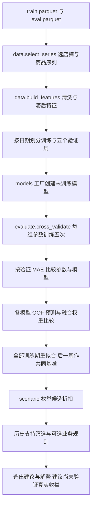

# 队友版本逐行学习指南：从一行数据到一个折扣建议

本文对应队友提交 `5b52099ab73e57c5afbb1915d0bc4a0adbde9032`。分析对象是 `discount_sales_prediction.ipynb`、`src/finalproject_pricingml/` 和生成 notebook 的 `scripts/build_notebook.py`。本指南通过阅读源代码及已有 notebook 输出编写；没有重新训练模型，也没有把示例数字当作实验结果。

阅读方法：先看第 1–4 节建立整体逻辑，再打开对应 Python 文件按行号读第 5–10 节；最后按第 11 节回到 notebook。行号固定对应上述提交，后续改代码会使行号移动。为便于 GitHub 阅读，文内使用仓库相对文件名；`文件:行号` 是代码定位，不是外部论文引用。空行、说明字符串和纯标题不逐字解释，可执行代码按单行或小逻辑块覆盖。

## 1. 先用自己的话说清楚这个项目

> 我们先利用截至今天的信息和明天的候选折扣，预测明天的标准化销量；通过按时间推进的验证比较模型，再让选出的预测模型为几个有历史支持的折扣打分，形成供经理参考的折扣建议。

这里有三个不同的问题，代码也分成三层：

| 层 | 输入 | 输出 | 应当如何评价 |
|---|---|---|---|
| 预测 | 历史销量、历史缺货、今天的折扣与活动、明天日历、明天给定折扣 | 明天的标准化销量 `pred_sales` | 在实际发生的折扣下，与真实记录销量比较 MAE、WAPE、MSE/RMSE |
| 决策 | 同一情境下多个折扣对应的预测销量 | 选一个候选折扣 | 检查支持度、约束、完整性、稳定性；不能仅靠销量预测 MAE 证明策略更赚钱 |
| 业务效果 | 真实实施新策略后的销量、价格、库存、浪费、成本 | 实现的收益和浪费变化 | 需要真正的干预评价；当前代码未完成 |

**CatBoost 和 RF 本身不输出折扣，也不学习“是否打折”的分类标签。** 它们输出一个销量数字。`scenario.py` 枚举折扣、计算目标，再 `argmax` 选折扣。所谓“先判断是否折扣，再选折扣深度”，在队友的第二版里是人工规则先删候选，再由销量模型打分；不是两个训练好的机器学习阶段。

`discount=0.8` 表示支付原价的 80%，即八折/20% off。数值越小，折扣越深。`sale_amount` 是标准化后的销量，不能直接称为“卖出 0.8 个”或“收入 HK$0.8”。

## 2. 整体执行顺序与每个文件负责什么

| 文件 | 核心职责 | 不负责什么 |
|---|---|---|
| `config.py` | 路径、列名、候选样本筛选规则、时间切分、颜色 | 不训练模型 |
| `data.py` | 读取原始数据，确定分析样本，构造不会直接使用未来销量的特征 | 不自动恢复潜在需求，不知道库存年龄 |
| `models.py` | 创建 kNN、RF、CatBoost、VotingRegressor | 不负责选日期、选最优参数、证明因果关系 |
| `evaluate.py` | 时间验证、误差指标、测试预测、OOF 与融合误差 | 不做真实定价策略的离线因果评价 |
| `scenario.py` | 给定模型枚举折扣、算代理价值、筛选和选取建议 | 不训练 RL，不模拟库存转移、不测量浪费 |
| `plots.py` | 把已算出的结果画图 | 不重新调参，图好看不代表证据更强 |
| `scripts/build_notebook.py` | 把说明文字与调用代码拼成 notebook | 运行它只会生成文件，不会执行里面的实验 |
| `discount_sales_prediction.ipynb` | 按讲故事顺序调用上述函数，并保存输出 | 不能因有输出就断定所有历史探索都能从头复现 |

`src/finalproject_pricingml/__init__.py:1–8` 是使用示例；第 10 行导入并暴露 `config/data/evaluate/models/plots`。`scenario` 在 notebook 后半段单独导入。

## 3. 数据形状与时间到底是什么

保存的 notebook 输出显示：312 条店铺×商品序列、122 个不同商品、5 家店、28,080 行特征表。其中训练期 25,896 行，后面共同基准周 2,184 行。这里的 28,080 **包括** 2,184 行测试期，不能把它全部称为训练样本。这些是队友现存输出中的计数，本指南未重跑。

一行不是一个顾客，也不是一笔订单，而是 `(store_id, product_id, dt)`。同一个 product 在不同店铺是不同序列；建 lag 时必须分店铺和商品，否则会把别的店的销量接进来。

设行日期为目标日 `T`，代码说明中的 `T=t+1`，经理决策时间为前一晚 `t=T-1`。

| 对象 | 形状/含义 |
|---|---|
| `feat` | `N` 行完整特征与辅助列；默认锁定模型只取 10 个特征 |
| `X = train[C.FEATURES]` | `N_train × 10` 的二维表，每列一个已知输入 |
| `y = train[C.TARGET]` | `N_train` 个实际标准化销量 |
| `model.predict(X_val)` | `N_val` 个预测数字，与验证行一一对应 |
| 一折 CV 结果 | 一行：参数 + fold + MAE/WAPE/MSE |
| 参数网格结果 | `参数组合数 × 5` 行，不是 `样本数 × 5` |
| OOF 预测 | 5 个验证周共 10,920 行，每行保留预测、真实销量与 fold |
| 测试表 `test` | 2,184 行，增加 `pred_rf` 等各方法预测列 |
| 未筛选 `response` | `2,184 × 8 = 17,472` 行，每个目标行复制 8 份，分别试一个折扣 |
| `support` | 312 行 × 8 个布尔候选列，按店铺商品给出历史支持 |
| `rec` | 理想情况下每个目标行恰好一个建议；函数目前没有强制断言完整覆盖 |

每个验证周 2,184 行。第 1 折训练 14,976 行，之后每折加上前一周的 2,184 行，故训练数为 14,976、17,160、19,344、21,528、23,712，最后重拟合用 25,896 行。这个结构叫 expanding-window validation。

**一次预测整周的代码，不代表在周初预测未来七天。** 特征是在合并日期后用 `shift` 构造的：6 月 27 日的 lag1 是 6 月 26 日真实已观察销量。模型参数在整周内固定，但每天的已知历史更新。因此它模拟的是每天预测下一天，不能说成“6 月 25 日晚上就完成未来一周的无更新预测”。

## 4. 手算一行特征与一个折扣建议

以下数字专门用于教学，不来自新增数据集、也不是模型实验结果。假设目标日是 2024-06-26（周三），同一店铺商品在 6 月 19–25 日的标准化销量为：

| 日期 | 6/19 | 6/20 | 6/21 | 6/22 | 6/23 | 6/24 | 6/25 |
|---|---:|---:|---:|---:|---:|---:|---:|
| 标准化销量 | 0.8 | 1.0 | 1.2 | 0.9 | 1.1 | 1.3 | 0.7 |
| 缺货小时数 | 0 | 1 | 0 | 0 | 0 | 0 | 2 |

再假设截至 6/25 的全部 25 个历史有效日销量总和为 24，6/25 折扣为 0.90、活动标识为 1，6/26 非假期。此时：

| 特征 | 手算值 | 为什么 |
|---|---:|---|
| `sales_t` | 0.7 | 目标日的前一天销量 |
| `sales_lag7` | 0.8 | 目标日前 7 天，即 6/19；相对于决策日 t 是 t−6 |
| `sales_mean7` | 1.0 | `(0.8+1+1.2+0.9+1.1+1.3+0.7)/7` |
| `sales_mean_to_date` | 0.96 | `24/25`；先 shift，故不含目标日 |
| `stockout_hours_t` | 2 | 前一天记录的缺货小时 |
| `discount_t` | 0.90 | 前一天实际折扣 |
| `discount_next` | 0.85 | 本次准备评估的候选折扣，可以改成 1、0.95、0.90 等 |
| `activity_t` | 1 | 前一天活动标识，不能换成明日实际活动再假装事先知道 |
| `holiday_next` | 0 | 目标日的日历信息 |
| `weekday_next` | 2 | pandas：周一=0，周三=2 |
| `stockout_days7` | 2 | 最近七天中，有缺货的天数为 2；仅供规则，不在默认 10 特征内 |

假设目标日后来真实记录销量是 1.4，它只出现在 `target_sales`，不能成为这一行的输入。训练阶段给模型 `X` 与 `y`，预测阶段只给 `X`。

再用一个独立的教学决策表理解目标函数：

| 候选 d | 假设模型预测销量 q̂(d) | 价值代理 d×q̂(d) |
|---|---:|---:|
| 1.00 | 1.00 | 1.000 |
| 0.95 | 1.08 | 1.026 |
| 0.90 | 1.15 | 1.035 |
| 0.85 | 1.20 | 1.020 |

`max_value` 选 0.90，因为 1.035 最大。`max_sales_within_value` 在价值不低于满价的 95% 时选最大预测销量，因此选 0.85。若启用队友的“昨日有至少 1 小时缺货则不折扣”规则，上面教学特征的缺货小时为 2，规则会先删掉所有折扣候选，最终只剩 1.00。这说明输出不只是模型结果，也由人为规则决定。

这张表没有证明 0.85 真的会卖出 1.20；每个未实际采用折扣的销量都是未观测反事实。没有货量、成本和价格，就不能从该表算真实利润或浪费。

## 5. `config.py`：所有实验共同使用的约定

| 代码位置 | 逐行/小段解释 | 修改时要注意 |
|---|---|---|
| `config.py:3` | 导入 `Path`，用跨平台路径对象操作文件。 | 路径拼接用 `/`，不是数学除法。 |
| `config.py:5` | 从当前 Python 文件向上两级找到项目根目录。 | 这取决于包实际安装位置；不能假设所有环境都以当前 shell 目录为根。 |
| `config.py:6–9` | 依次定义 data、raw、processed、results 目录。 | 定义路径不会创建目录。输出前应确保 results 存在。 |
| `config.py:12–14` | `KEY` 唯一识别序列；加日期成为 `ROW_KEY`；目标列叫 `target_sales`。 | 合并预测、检查重复、对齐模型都应使用 `ROW_KEY`。 |
| `config.py:17–18` | 锁定 10 个输入列及顺序。 | 增删特征后要重建所有受影响实验；不能只换列名而继续读旧分数。 |
| `config.py:19` | 天气列列表，默认未纳入 FEATURES。 | “表里有天气”不等于“模型用了天气”。 |
| `config.py:22` | 样本筛选时，`discount < 0.95` 才算折扣日。 | 0.95 本身不算；后面诊断分箱却把 0.95 算 moderate，定义不完全一致。 |
| `config.py:23–26` | 折扣日占比 15%–85%、至少切换 6 次、零销量比例低于20%，选可用系列最多的5家店。 | 这是分析样本的选择，不是训练超参数；改变它会换题目范围。 |
| `config.py:30–36` | 五个连续验证周：5/22、5/29、6/5、6/12、6/19 开始。 | 每折训练截止必须早于该周第一天。 |
| `config.py:37–38` | 图表日期标签与 6/26 测试开始日期。 | 代码只设测试起点，未设终点；若补入更晚数据会全部成为 test。 |
| `config.py:41–42` | `pd.cut` 边界：`(0,.8]` 深折扣、`(.8,.95]` 中折扣、`(.95,1]` 无/轻微折扣。 | 这是诊断分组约定，不等于真正严格满价。 |
| `config.py:45–53` | 方法颜色和坐标背景。 | 改颜色不需重训；方法名与配色键须一致。 |

## 6. `data.py`：从原始表变成学习问题

### 6.1 `select_series`：为什么只研究这 312 条序列

| 代码位置 | 解释 |
|---|---|
| `data.py:8,10` | 引入 pandas 与统一配置 `C`。 |
| `data.py:13–18` | 定义函数和返回值说明；返回全系列统计、门店排名、最终选择三张表。 |
| `data.py:19` | 调用者未传路径时使用 `data/raw/train.parquet`。`or` 是兜底表达式，参数应是路径，不能传 DataFrame。 |
| `data.py:20–21` | 只读所需 7 列，按店铺、商品、日期排序。排序保证后面的切换数有时间含义。 |
| `data.py:22` | 生成布尔列 `disc_day`；True 会在求均值时按 1 算，所以 mean 就是折扣日比例。 |
| `data.py:24` | 以店铺商品分组；`g` 不是新表，而是待执行聚合的分组对象。 |
| `data.py:25–33` | 每个系列压缩成一行：城市、折扣比例/波动/最低值、平均销量、零销量占比、缺货日占比。注意“缺货日占比”用小时数 `>0`，不是平均缺货小时。 |
| `data.py:34` | `x != x.shift()` 比较相邻日折扣状态；首次与空值比较也记一次，所以最后减 1。只统计跨越0.95阈值的切换，九折变八折不会算切换。 |
| `data.py:35–39` | 三个布尔条件以 `&` 同时满足；`between` 包含15%和85%边界，零销量比例用严格 `<20%`。 |
| `data.py:41–43` | 取消多层索引后按门店聚合，统计系列数与可用系列数，按后者降序。 |
| `data.py:44` | 取前5家店；不是随机抽样。 |
| `data.py:45` | 同时满足可用与属于前5家店的系列才留下。 |
| `data.py:46` | 返回三张表，后续用 `selected` 确定数据范围。 |

这个选择充分利用有折扣变化的系列，适合小规模课程实验；它不代表全部50,000系列或所有城市。它使用整个90天训练文件选 cohort，所以在最早验证周之前已经参考了更晚训练日期的系列行为。当前可以称固定、回顾性 cohort；若要模拟严格上线，应在第一个验证周之前冻结 cohort，或把 cohort 选择也放进每折训练期。

### 6.2 `build_features`：先对齐日期，再 shift

| 代码位置 | 解释与关键细节 |
|---|---|
| `data.py:49–54` | 函数收店铺商品键与原始目录；既可接索引中的键，也可接普通列。 |
| `data.py:55–56` | 使用默认 raw 目录；reset_index 后取两列键并去重。去重防止 merge 把原始记录成倍复制。 |
| `data.py:57–59` | 列出要读取的12列：3键、销量、缺货小时、折扣、假期、活动、3天气；合并train与eval。合并本身不等于泄漏，关键是随后只向过去取值。 |
| `data.py:60` | 内连接 selected keys，仅保留选中的店铺商品。 |
| `data.py:61–62` | 转日期类型；按系列日期排序、重设行索引。shift依赖此顺序。 |
| `data.py:65` | 检查每个店铺商品日是否重复；有重复立即报错。 |
| `data.py:66` | 每系列相邻日期差必须全部为1天。若日期有缺口，shift(7)将不再一定等于7天前，因此先拒绝。 |
| `data.py:67` | 检查读取列全部非空。之后才主动制造某些NaN；这两步不矛盾。 |
| `data.py:69` | 折扣上限裁到1.0，略高于1的值视作满价；没有设置下限，负折扣仍应另加校验。 |
| `data.py:70–71` | 折扣恰为0的日，其销量和折扣设为NaN，避免拿可能异常记录做目标或lag。把0叫“赠送/异常”是清洗假设，应报告该类行数，不能当作已证实业务事实。 |
| `data.py:74–75` | 创建分组和初始特征表，只复制3个标识列。 |
| `data.py:76` | 每系列销量向后移动1行：目标日这一行拿到前一天销量。 |
| `data.py:77` | 向后7行，拿目标日同星期几的前周销量。 |
| `data.py:78` | 先 `shift(1)`，再对最近7行求均值，至少5个有效值才算。先rolling再shift也可实现同一时点，但漏shift会把目标销量混进去。 |
| `data.py:79` | 先shift再expanding，得到该系列截至昨日的所有有效历史均值，至少5个有效值。不等于整个训练期固定均值。 |
| `data.py:80–81` | 前一天缺货小时与折扣各shift1。 |
| `data.py:82` | 目标日折扣不shift。训练时用实际折扣，场景时用候选折扣；业务上假定经理能在决策时设定它。 |
| `data.py:83` | 活动标识shift1，因此用昨日活动。 |
| `data.py:84–85` | 目标日假期和星期几直接可由日历获得。星期几是0–6数值；在kNN中会产生周日离周一很远的线性距离假设。 |
| `data.py:86–88` | 前一天雨量、温度、湿度。表里保存但默认模型不用。 |
| `data.py:89` | 目标是该行日期真实记录销量，不shift。 |
| `data.py:90` | 当天实际缺货小时仅为事后诊断保存；它不在FEATURES中。注释说“sensitivity check”，并不说明现有主notebook已运行该检验。 |
| `data.py:93` | 先shift前一天小时数；`.gt(0)`变成是否缺货；`.where(...)`保留原缺失而不把缺失误算0；最近7日求和得到缺货天数，至少1个有效日即可。 |
| `data.py:94` | 任何列有NaN的行都丢弃，含辅助天气列。正常连续系列前7日主要因lag7缺失被删；异常0折扣可影响当天、下一天、7天后的行。rolling允许缺少最多2个有效销量，不能概括成所有留下行都有7个有效销量。 |
| `data.py:97–98` | 默认train，日期≥6/26标test。这里按日期而非来源文件切分。 |
| `data.py:99–101` | 默认fold0；落入五个验证周的train行分别标1–5。fold0不表示“第0折验证”，它是初始训练历史或test标记。 |
| `data.py:102` | 返回完整特征表，不在此训练。 |

`target_stockout_hours` 与 `stockout_days7` 都存在 feat 里，但只要模型明确取 `C.FEATURES`，它们不会偷偷进入训练。不要以后为方便把 `feat.drop(columns=[TARGET])` 全部送给模型，那样会连 `dt`、split、目标日缺货一起混入。

### 6.3 缓存与摘要

| 代码位置 | 解释/风险 |
|---|---|
| `data.py:105–108` | 默认读 `processed/features.parquet`。只有 `rebuild=True`、文件不存在、或缺少stockout_days7列才重建。只要这一列存在，改特征逻辑后仍可能读旧缓存。 |
| `data.py:109–112` | 重选系列；创建输出目录；保存selected_series.csv；构建并存parquet。这里的CSV是cohort记录，parquet是可训练表。 |
| `data.py:113` | 读回缓存。条件判断时可能先读一次，最后又读一次；效率改进可只读一次，但不是统计问题。 |
| `data.py:116–118` | 按split和fold统计行数、起止日期。此表是检查实验口径的第一步。 |

安全改法：给缓存记下原始文件哈希、代码版本、FEATURES及切分配置；配置变了就明确重建。先另存新实验目录，避免旧CSV与新feature表被混合引用。

## 7. `evaluate.py`：公平比较模型的核心

### 7.1 指标与时间验证

| 代码位置 | 解释 |
|---|---|
| `evaluate.py:9–12` | pandas处理表，joblib的`Parallel/delayed`并发运行独立训练任务，配置提供目标和特征名。 |
| `evaluate.py:15–18` | 误差 `e=y−ŷ`；MAE=`mean(abs(e))`，WAPE=`sum(abs(e))/sum(y)`，MSE=`mean(e²)`。WAPE输出比例0.30，展示百分数时才×100；未处理sum(y)=0。 |
| `evaluate.py:21–26` | 只取train或test；test用copy避免新增预测列时影响原表。 |
| `evaluate.py:29–30` | 获取大于0的fold并排序。 |
| `evaluate.py:33–37` | 该fold为val，日期早于该fold最小日期的所有行为train。`<`严格防止训练混进该周。传入空fold未显式报友好错误。 |
| `evaluate.py:40–45` | 对每折直接拿sales_mean7或指定列做预测，计算指标并以fold为索引。不需要fit，这就是baseline。 |
| `evaluate.py:48–51` | 获得该折train/val；新建一个模型，使用X/y训练。每候选每fold都重新创建，不能复用已学到后面数据的模型。 |
| `evaluate.py:52` | 对val输入预测，输出参数、折号和误差。Python `**dict` 将字典字段展开到同一行。 |
| `evaluate.py:53–55` | 可选describe函数补充例如实际最大树深的诊断；最后返回一条结果。 |
| `evaluate.py:58–64` | API约定：grid是参数字典列表，factory支持关键字参数。解释为何模型自己并行时外层n_jobs=1。 |
| `evaluate.py:65` | 先排除test，避免后续意外把测试期做CV。 |
| `evaluate.py:66–68` | 每组参数×每折构造延迟任务，再并行执行并汇总DataFrame。`delayed`本身只描述任务，不立刻训练。 |
| `evaluate.py:71–78` | 按参数键分组，对5折MAE/WAPE/MSE做等权平均。当前每周行数相同，等权MAE等于合并行MAE；WAPE等权均值一般不等于合并WAPE。 |
| `evaluate.py:79` | 算周间MAE标准差，衡量不同周难度变化；不能当作独立样本标准误或统计显著性检验。 |
| `evaluate.py:80–81` | 按调用者请求汇总额外列，例如所有fold里最深的一棵树。 |
| `evaluate.py:82–85` | 将fold展开成列，与同fold baseline比较，计数获胜周数。索引对齐比盲目按位置减更安全。 |

手算指标：若真实销量 `[1,2,3]`、预测 `[1.2,1.5,3.3]`，绝对误差是`[.2,.5,.3]`，MAE=`1/3`，WAPE=`1/6≈16.7%`，MSE=`.38/3≈.1267`，RMSE=`sqrt(.1267)≈.356`。这也是教学例子，不是项目得分。

为什么用MAE调参：它直接表达典型绝对预测偏差，不让极少数大误差支配所有选择。RMSE/MSE能揭示大失误，WAPE便于相对总体销量理解。主标准先确定为MAE，再辅助报告其他指标；不能看完结果再挑最有利的指标。

### 7.2 最终共同基准周与分组诊断

| 代码位置 | 解释 |
|---|---|
| `evaluate.py:88–94` | 输入模型名→未训练模型对象的字典；输出带预测的test表和已训练模型字典。 |
| `evaluate.py:95–99` | 分出全部train与test；逐模型在完整训练期fit，预测共同后续周。只重拟合一次，每天更新的是lag特征，不是模型参数。 |
| `evaluate.py:100–103` | 加7日均值、同星期基线、折扣档位，返回test与fitted。 |
| `evaluate.py:106–107` | `pd.cut`使用配置边界，默认右端点包含。0.8是deep，0.95是moderate。 |
| `evaluate.py:110–114` | 逐方法计算全test指标，转置成“每方法一行”；补RMSE=`sqrt(MSE)`。 |
| `evaluate.py:117–120` | 先每行绝对误差，再按给定日期/店铺/折扣档位分组求平均，同时附组内行数。小组样本少时不能只看排名。 |
| `evaluate.py:123–125` | 各组真实销量均值与预测均值，帮助看系统性高估/低估。但均值接近仍可能个体误差很大。 |

当前保存的测试输出（四舍五入，**读取已有输出，未重跑**）是：

| 方法 | MAE | RMSE | 与7日均值相比MAE降低 |
|---|---:|---:|---:|
| 7日均值 baseline | 0.3142 | 0.5209 | — |
| 同星期上周 baseline | 0.3998 | 0.6171 | −27.2% |
| kNN，k=25 | 0.3040 | 0.4900 | 3.2% |
| Random Forest | 0.2923 | 0.4646 | 7.0% |
| CatBoost | 0.2896 | 0.4603 | 7.8% |
| RF+CatBoost，各50% | 0.2892 | 0.4593 | 7.9% |

这是队友提交的结果，不要与我们旧main版本的0.2873混在一张表里当成同一模型。两版超参数不同；baseline相同到四位小数也不能单独证明全部输入、行键、target逐元素相同，应该真正按ROW_KEY比较。

### 7.3 OOF 与融合

| 代码位置 | 解释/修改边界 |
|---|---|
| `evaluate.py:128–134` | OOF只取train期：每个验证样本由未见过该验证周的模型预测。它不是训练集拟合值。 |
| `evaluate.py:136–139` | 内部one函数按某折训练，然后返回键、fold、真实target和pred；params缺省用工厂默认值。 |
| `evaluate.py:141` | 执行各折并纵向拼接，重设行号。当前fold顺序固定，便于后面按位置融合。 |
| `evaluate.py:144–148` | score_blend约定各模型预测必须“相同行、相同顺序”，但没有代码assert验证。 |
| `evaluate.py:150–152` | 取模型名、构造权重Series、除以总和归一化。未检查非负权重或总和0；新增UI输入时须补。 |
| `evaluate.py:153–155` | 以第一模型的键和target为基准，把各模型`pred.values`乘权重相加。`.values`丢掉索引，因此错位会静默混配。 |
| `evaluate.py:156` | 按fold算融合MAE；外面再对5个MAE平均。 |

50/50融合：`ŷ=(ŷ_RF+ŷ_CatBoost)/2`。例如真实销量1.0，RF预测1.2、CatBoost预测0.9，融合1.05，误差抵消；若二者都预测1.3，融合仍1.3。队友保存的OOF误差相关约0.97，说明二者多数时候犯相似错误，所以提升小。相关不等于“已证明有性能上限”，也不证明某个业务规则正确。

Notebook又用同一批OOF来选参数、选权重，存在选择乐观偏差。不能把选出来最优权重的同一OOF MAE当成完全独立的新证据。更严格版本需要内层选参数/权重，外层时间块评价，或冻结后再用新时间段。

## 8. `models.py`：模型到底怎样学

### 8.1 通用接口与kNN

| 代码位置 | 解释 |
|---|---|
| `models.py:7–14` | 引入数值工具、sklearn基类、RF/kNN、Pipeline、StandardScaler与配置。 |
| `models.py:17` | 定义自制transformer，继承sklearn接口，能放进Pipeline并被clone。 |
| `models.py:24–26` | 保存权重字典与特征顺序；`__init__`只记录设置，不看训练数据。 |
| `models.py:28–30` | fit时按特征顺序生成权重向量，未指定列默认1；以`weights_`保存，尾下划线是sklearn“拟合后的属性”习惯；返回self支持链式调用。 |
| `models.py:32–33` | 将X转成array，每列乘对应权重，通过broadcast同时处理所有行。 |
| `models.py:36–38` | 创建三步Pipeline：训练集标准化→特征权重→kNN回归。此处返回未fit模型。 |

标准化是 `z_j=(x_j−μ_j)/σ_j`，μ和σ由该折train学得；val必须用同一μ和σ。否则看了未来分布或使训练与预测不在同一坐标系。kNN计算 `distance²=Σ[w_j(z_j−z'_j)]²`，找最近25个历史行，平均这些行的真实销量。历史行可以来自其他店铺商品，因为模型未把ID加入距离；销量历史特征承担区分系列尺度的部分作用。

**权重2的精确定义：某维标准化坐标差变2倍，在欧氏距离平方中贡献变4倍。** 原注释“count twice as much”只是直觉描述，不宜当严格权重公式。函数参数`weights`在这里是“特征坐标权重”，不是KNeighborsRegressor的“近邻按距离加权”参数；两种概念不要混淆。默认kNN各近邻等权。

k小：局部、容易跟噪声；k大：平滑、可能混入不相似产品。`fit`并非什么都不做：它仍保存训练X/y，Pipeline也拟合scaler；只是kNN没有像神经网络那样用梯度下降更新大量权重。

### 8.2 Random Forest

| 代码位置 | 解释 |
|---|---|
| `models.py:41` | 默认最大深度10、叶子至少3行、300棵树、每次分裂考虑50%特征、随机种子0。 |
| `models.py:43` | 把`None`或展示用字符串`"No limit"`转真正的None，其他转整数。 |
| `models.py:44–45` | 创建RF；`n_jobs=-1`使用可用CPU并行；`**kwargs`允许额外参数，例如criterion或max_samples。没有显式设置的选项取库默认值。 |
| `models.py:48–50` | 从已训练forest的每棵树取depth，返回最大值。它是诊断值，不是重新设置深度。 |
| `models.py:53–55` | 取模型feature_importances_，配上特征名，降序排序。 |

每棵树把类似输入划到叶子，叶子用训练销量的平均数预测。一个分裂会挑某特征和阈值，让子节点的平方误差总和下降最多。RF通过bootstrap样本与随机特征子集形成不同树，最后平均树输出。树之间不是严格统计独立；它们仍共享原始训练集。

限制深度/增大叶子数一般让单树更平滑；增加树数主要降低森林随机波动并增加计算量，不等价于boosting不断纠正残差。这里不需StandardScaler，因为一列的线性缩放通常不改变其排序或可实现的阈值分组。

`feature_importances_`在此RF中是训练分裂不纯度下降的累计归一化贡献。相关特征会分摊/替代信息，高可分裂度特征也可能受偏好；不能读成“该特征导致销量X%的变化”。

### 8.3 CatBoost

| 代码位置 | 解释 |
|---|---|
| `models.py:58` | 工厂默认depth6、lr.05、500次、RMSE、seed0。注意**默认值不是notebook选出的最终depth5/lr.03**。 |
| `models.py:64` | 函数内延迟import，只有调用CatBoost时才需要该库。 |
| `models.py:66–68` | 设置树深、学习率、迭代数、损失、种子；verbose0静音；禁写catboost_info；thread_count−1使用CPU线程；额外参数从kwargs加入。 |
| `models.py:79–87` | 学习曲线函数使用给定参数创建CatBoost。 |
| `models.py:88` | 记录的评价指标设MAE，不自动改变训练objective。训练仍可优化RMSE。 |
| `models.py:89–91` | 给fit同时传train和val；读每轮评价结果，形成train/validation两列。此处eval_set用于曲线；不是把验证目标当训练样本。返回索引从0开始，标“树数”时应加1。 |

简化数学是 `F_m(x)=F_{m−1}(x)+η·h_m(x)`：前面所有树的预测加上下一棵树的小修正。在平方误差下，拟合负梯度可直观理解为追赶残差；对其他损失不能一律说成普通销量残差。学习率η小，每步更保守，往往需更多树；depth控制一棵树能表达的交互复杂度。

队友在本notebook用的是10个数值输入，没有声明`cat_features`。因此讲解优势时可以说对表格非线性和交互有表达力，但不能说本实验的成功证明了CatBoost类别变量编码能力。实际最终参数由builder:435–436从CV结果读取，现存输出为depth5、lr0.03、500trees；不要在新代码直接`make_catboost()`而以为重现了锁定模型。

训练曲线下降、验证曲线先降后升，提示在这一折中迭代过多可能过拟合。代码没有给最终模型自动early_stopping；最终迭代数由grid选定。只看最后一折曲线也不能保证所有未来周的最优迭代数相同。

### 8.4 融合器

| 代码位置 | 解释/风险 |
|---|---|
| `models.py:71–73` | 用sklearn VotingRegressor包装多个回归器，名称里的Voting不是多数票分类，而是预测均值。 |
| `models.py:75` | 若没传members，则RF与CatBoost都用工厂默认值。这里默认CatBoost与notebook最终模型不一致。 |
| `models.py:76` | 构造融合器，weights=None表示等权；fit时内部各成员重新训练，不直接复用先前已fit的单模型对象。 |

Notebook cell46正确显式传了锁定RF和CAT_BEST，因此该cell的50/50与工厂裸调用不同。安全做法是将锁定参数集中记录，并所有单模型、OOF、最终ensemble都从同一份参数构造。改变RF_DEPTH/RF_LEAF后，builder:513的OOF仍裸用`make_rf`默认值，也要一起修正。

## 9. `scenario.py`：如何从预测变成建议，以及哪些解释不成立

### 9.1 生成候选与两个目标函数

| 代码位置 | 解释 |
|---|---|
| `scenario.py:10–15` | numpy/pandas和配置；8个候选从1到0.6，不是连续优化，也不是RL。 |
| `scenario.py:18–25` | 函数收已fit模型、目标情境rows、候选、特征列表、单位成本比率。cost是假设参数，不是从数据估计出来的成本。 |
| `scenario.py:26–30` | 循环候选d；复制每行10个输入；仅替换discount_next；预测所有行；保存3键、d和预测销量。别的历史特征不变。 |
| `scenario.py:31` | 把候选表纵向拼接，再计算价值。每行/每候选一次预测，但批量向量化执行。 |
| `scenario.py:34–36` | `pred_value=pred_sales×(discount−cost)`；变cost只需重算乘法，不重训练也不重新预测。 |
| `scenario.py:39–47` | 定义推荐函数；key仍是店铺商品目标日。 |
| `scenario.py:48–50` | max_value：每个key取pred_value最大行的索引，返回那些行。并列值取第一个，当前候选顺序偏向较浅折扣，但应明确写规则而不依赖顺序。 |
| `scenario.py:51–53` | max_sales_within_value：先找每key满价代理价值，再保留价值≥满价×阈值的候选。 |
| `scenario.py:54–55` | 在可行候选里找销量最高者，而不是价值最高者。 |
| `scenario.py:56` | rule拼错就报错，避免静默改用其他目标。 |

cost=0时目标是销量×价格比例；若有原价P且销量是实际单位，真实收入应是`P×d×q`。当前q标准化，因此只能叫sales-value proxy。cost=.7时`d−.7`是原价单位的假设毛利率差；d=.6会产生负单位毛利代理。成本如果已经沉没，与生产/补货决策联动时应重新定义目标，不能随便换cost然后把结果叫真实利润最优。

### 9.2 响应曲线、单调性与历史支持

| 代码位置 | 解释/限制 |
|---|---|
| `scenario.py:59–63` | 按候选求全体平均预测销量/价值，再除以满价平均。这是“均值之比”。Notebook后面算逐行lift再平均，是“比值之均值”，两者不必相同。满价不存在或分母0应处理。 |
| `scenario.py:66–70` | pivot成每key一行、每候选一列；按1→深折扣排列，检查相邻预测差是否都≥−1e−9；输出单调行比例。容差是浮点误差保护，不是经济显著性门槛。 |
| `scenario.py:73–85` | 对每个d，统计同一店铺商品训练历史中`abs(discount_next−d)≤.025`的天数；至少3天就支持。 |
| `scenario.py:86` | 返回312×8的布尔表；不是训练模型。 |
| `scenario.py:89–94` | 把宽support表stack成长表，按序列+候选合并；没有支持的行按False删除。 |

历史支持筛选能避免“一个系列从未打过六折，却强行预测其六折效果”的极端情况；但3天可能全是特殊清仓日，不能保证普通日也有可比支持。它是系列层面的粗筛选，不是条件重叠/因果识别检验。统计支持只用建好特征后的train行，也就排除了最初暖身日期，未用全部原始90天。

RF/CatBoost在这份代码中没有硬性单调约束，97.8%单调是现存预测的一项描述。单调并不说明价格效应无混杂，非单调也不一定是程序bug；应检查数据和模型假设。

### 9.3 缺货规则：必须区分观测事实与业务假设

| 代码位置 | 实际执行动作 | 能解释到哪一步 |
|---|---|---|
| `scenario.py:97–105` | 注释把缺货解释为清空、把一周无缺货解释为积压。 | 这是作者的业务推断，不是代码证明的事实。补货批次、货龄、临期量不在输入中。 |
| `scenario.py:107` | 定义3个状态文字标签。 | 标签“stock turning over”本身也没有测量周转率。 |
| `scenario.py:110–119` | 当昨日缺货小时≥阈值标sold out；否则过去7日缺货天数=0标无缺货一周；其余第三类。`np.select`按第一个命中条件优先。 | 昨日有缺货不证明明日全部新货；连续有货不证明同一批货存放七天。 |
| `scenario.py:122–129` | 把每行状态按ROW_KEY合并到所有候选行。 | 状态只由过去信息计算，在时点上合法，业务解释却仍待验证。 |
| `scenario.py:130` | 为每个key检查是否至少存在一个d<1的支持候选，再映射回长表每行。 | 同一key的所有候选会得到相同has_discounted布尔值。 |
| `scenario.py:131–132` | sold-out组删除全部d<1；无缺货一周组如果有折扣候选就删除d=1；返回其余。 | 前者强制不折扣；后者强制折扣。建议折扣比例降低可能只是规则作用，不是模型变准。 |
| `scenario.py:135–144` | 先guarded_candidates，再在剩余候选执行指定目标函数。 | 是规则包住预测优化，没有第二个分类器。 |
| `scenario.py:145–146` | 按状态添加decided_by解释；其余叫model。 | 无缺货组若没有折扣候选、实际留了满价，标签仍可能写discount required，解释需核对。 |
| `scenario.py:147–150` | 只有min_gain>0才找剩余候选里的满价价值，按推荐行key对齐。 | 满价被前面规则删除时base_value为NaN，门槛就不会起作用。 |
| `scenario.py:151–153` | 若推荐折扣但价值低于满价×(1+min_gain)，改回满价，并记hurdle解释。 | 当base_value≤0，相对比例门槛容易失去含义；应改成明确的绝对/相对改善规则。 |
| `scenario.py:154` | 返回建议表。 | 没有强制每key一行、无缺失、候选合法、价值一致的完整审计。 |
| `scenario.py:157–168` | 与昨日折扣比：没在运行→no discount running；d≥.95→stop；比昨日高>.025→lighten；低>.025→deepen；否则continue。 | 这里把.95算stop，而前面折扣分箱把.95算moderate；需要统一或明确两种不同定义。 |

两个值得优先修的边界：

1. 若满价历史不支持，support先删满价，随后sold-out规则再删全部折扣，就会出现零候选、整行消失。当前已存输出所有312系列支持满价，所以这不是已证明本次结果受损，而是扩展数据后的潜在故障。应输出“需要经理判断/不推荐”及原因，不能把缺行隐藏掉。
2. `guarded_recommend(..., rule="max_sales_within_value")` 对无缺货一周组先删满价，而该目标又需要满价参考；映射不到baseline会使该组全部不满足约束并消失。现notebook守护场景用max_value，未触发这个组合。安全改法是把满价参考在过滤前单独保存传入，或清楚拒绝不兼容组合。

建议把状态名改成观测语言，例如“昨日有缺货记录”“过去7日无缺货记录”，再把“禁止折扣/必须折扣”作为可选、明确标注的假设规则。实际货龄或余量不足时，默认不应根据“连续有货”强制打折。

## 10. `plots.py`：把图看成数据的另一种展示

| 代码位置 | 解释 |
|---|---|
| `plots.py:3–8` | 引入绘图、表格、颜色配置；统一点与线的样式字典。 |
| `plots.py:11–17` | 设置背景、网格、边框和刻度，纯展示。 |
| `plots.py:20–26` | 建图并给每个轴套样式；此工具假定axes是单轴或一维轴数组，若扩展为2×2需flatten。 |
| `plots.py:29–33` | 自动整理边距，可选保存PNG，再返回figure。 |
| `plots.py:36–44` | kNN图先按权重/k平均fold MAE，找跨权重全局最佳k，算baseline均值。 |
| `plots.py:46–58` | 左图画baseline横线和各权重k曲线，k使用对数轴。只改显示尺度，不改训练。 |
| `plots.py:60–69` | 右图固定同一个最佳k画5周误差，添标题并保存。不是每条权重各自最佳k。 |
| `plots.py:72–78` | RF图按leaf取不同depth的MAE，每个leaf一条线。 |
| `plots.py:79–84` | 设标签、标题、图例并保存；小纵轴差异可能视觉放大，要同时看实际差值。 |
| `plots.py:87–99` | 按模型画各周MAE，可给指定列逐点加数值。 |
| `plots.py:100–106` | 固定纵轴与日期标签、标题并保存；新模型误差超出ylim会被裁掉，应检查。 |
| `plots.py:109–124` | 比较图先算每行各模型误差，按折扣档平均，再组装CV、全test及三个折扣档的5组数。没有某档时`.loc`可能KeyError。 |
| `plots.py:126–134` | 根据方法数确定柱宽，每个方法画一组错开的柱子，并标注数值。 |
| `plots.py:135–141` | 设置坐标、固定ylim，保存，返回图与对应数值表。图和表同源便于核验。 |
| `plots.py:144–159` | 每个学习率一张subplot，画train/val随迭代变化，标最低val位置。若只有1个curve，axes是单轴，现代码zip/axes[0]需适配。 |
| `plots.py:160–163` | 添加图例和总标题保存；标题硬写“validation turns up”，换数据后要验证仍成立。 |
| `plots.py:166–173` | ensemble权重曲线，RF与CatBoost各自CV误差作参考线，标最优权重。 |
| `plots.py:174–178` | 坐标与图例，保存。图里权重最低点不自动等于最终notebook选择。 |

不应仅凭多条曲线“看起来差不多”宣称统计等价。可以说在这几个验证周观察到差距小；要量化不确定性，应考虑同系列/同一天误差相关，采用合适的成组或时间块分析，而不是把10,920行视为独立。

## 11. Notebook每个代码cell与生成脚本逐段映射

Notebook没有稳定源码行号，JSON物理行号也不利于阅读。因此这里用**从1开始的cell序号**定位，再用生成脚本源码行号解释。当前共65 cells，其中31个code cells，已有execution_count为1–31。修改Markdown后cell编号也可能改变。

生成器自身：`scripts/build_notebook.py:4`导入nbformat；`:6–8`新建notebook、登记kernel、初始化cells；`:9–10`定义md/code包装器，去首尾空白并加入cell列表；`:908–910`把cells写出并打印数量。运行生成器会覆盖原notebook，生成的code cell没有执行输出。它不是“只更新文字、保留旧结果”的工具。

下表`B:行号`统一指 `scripts/build_notebook.py:行号`。这是主notebook的每个可执行逻辑块：

| Notebook cell（执行序号） | 源位置 | 逐段解释与检查点 |
|---|---|---|
| 2（1） | B:33–44 | 33–37导库和package；41设置RERUN_TUNING=False；43–44只设展示精度/宽度。False仍会训练最终模型，也会覆盖部分结果文件；不是完全只读模式。 |
| 6（2） | B:93–98 | 93读取/生成features；94读selected；96按店统计系列数；97展示排名；98打印系列数、产品数、全部特征行数。 |
| 8（3） | B:108–111 | 108销量除以每系列均值；109–110分折扣档；111显示档位样本数和相对销量。**这里使用feat，包括test周**，所以EDA不能描述为完全未看测试。改进时只用train并把分母也限定为当时已知历史。 |
| 10（4） | B:150–151 | 展示前5行与描述统计，供人工检查特征数值/范围，不训练。 |
| 12（5） | B:166 | 显示split_summary；应核对日期和行数后再继续。 |
| 14（6） | B:191–197 | 191只取train；192/193算两基线各周分数；195合并；196加平均；197展示。主baseline是7日均值。 |
| 16（7） | B:213–222 | 213–216定义读历史CSV、去k=0基线、每weighting取MAE最小k的函数；218–219读取两份历史网格摘要；220–222显示。无论RERUN开关如何，这两份历史实验都只是读文件。 |
| 18（8） | B:232–234 | 展示去天气后的历史结果及前后对照。没有在该cell重训天气实验。 |
| 20（9） | B:248–262 | 248两种权重；249共2×8=16种kNN组合；251–256决定80次CV训练或读缓存；258汇总；259展示；261–262绘图。False时过滤k>0，因为旧CSV里包含baseline。 |
| 22（10） | B:309–311 | 手动锁k=25；取对应5周结果；与baseline均值比较。若换数据，锁值不自动随grid最低点更新。 |
| 24（11） | B:330–332 | 读取历史RF叶子/特征子集/天气36组合摘要；pivot展示；统计五周全部胜baseline的组合数。该历史grid也不受RERUN开关重跑。 |
| 26（12） | B:344–357 | 344深度4档/leaf4档；345共16组合；347–351重跑80fits或读CSV（depth强制字符串）；353聚合MAE与实际树深；354–355展示；357绘图。 |
| 28（13） | B:389–392 | 手动锁depth10、leaf3；取该结果，与kNN/baseline比较。 |
| 30（14） | B:409–423 | 409第1网格12组合；410第1b网格27组合；411参数键；413–418两轮重训195fits或读文件；420–423显示第1轮摘要。打印语句中的RF/kNN值是硬编码文本，会随新结果过时。 |
| 32（15） | B:433–437 | 汇总第1b；435按平均CV MAE找最低参数组合；436把numpy类型转普通int/float；437打印。CAT_BEST为动态选择，Markdown锁定参数却是固定文字。 |
| 34（16） | B:447–461 | 447–451列8种单因素检查；454–456各自5折评价；457以第一个配置为参照算变化；458存CSV；460读缓存；461显示。这些继续复用相同验证周，属于探索。 |
| 36（17） | B:475–483 | 476最后一折train/val；477三个lr各训练到3000次；478宽表保存；480–481读取多层表头；482画曲线；483报告最小误差与位置。索引从0起，iteration数字少1；不要按图上rounding反推精确最佳轮数。 |
| 38（18） | B:496–498 | 从第1b折结果中过滤CAT_BEST对应5行；与RF/kNN/baseline均值并排。 |
| 40（19） | B:512–525 | 513生成RF/Cat/kNN各5折OOF；514存三列预测、actual、fold，**未保存ROW_KEY**；515扫RF权重0,.1,…,1，算每种平均MAE；516存；518–519读；521计算预测−实际；523相关矩阵；525权重曲线。RF裸用工厂默认，要警惕与手动锁参数不同步。 |
| 42（20） | B:539–543 | 不论sweep最小点哪里，都选简单50/50；540算各周绝对误差均值；541改显示列名；542表；543统计胜RF/Cat周数。已有输出是胜RF4/5、胜Cat5/5，不是旧main说的各5/5。 |
| 44（21） | B:555–565 | 555–561拼5方法各周MAE；562颜色映射；564显示；565画图。559的Cat参数标签写死，改CAT_BEST后要同步。 |
| 46（22） | B:577–593 | 577–582显式创建三个单模型和ensemble，fit全部train并预测test；583–584方法名→预测列；586行数；587–588指标；589–590相对baseline改善；592–593覆盖CSV。ensemble内部再fit RF/Cat，故这里实际有5次底层模型训练（kNN、RF、Cat、ensemble内RF、ensemble内Cat）。 |
| 48（23） | B:606–609 | 打印折扣档位MAE及真实/预测均值。可以发现深折扣表现较弱，不能推出深折扣因果增量。 |
| 50（24） | B:621–624 | 分日期、分门店MAE。用于诊断哪里难，不是新的独立测试集。 |
| 52（25） | B:632–633 | RF重要性与Cat重要性/100并排。尺度都归一化不等于指标定义相同；不可据20%vs10%推出某模型“更懂折扣”或解释性能因果。 |
| 54（26） | B:643–649 | 删除同星期弱基线仅用于图；644–647组织CV均值和颜色；648画综合图并返回同源表；649展示。原score表仍保留两个baseline。 |
| 56（27） | B:694–701 | 导scenario；696对所有test行×8折扣预测；697曲线；699单调比例；701不受限max_value的候选频数。它是模型what-if，不是8次真实折扣实验。 |
| 58（28） | B:711–747 | 711–715用train统计支持并过滤；717–721统一band/actual满价预测/最深支持候选；722–723执行两目标；725–726候选比例；729–740描述推荐比例、与历史档位关系、预测lift；742–747交叉表。cat.codes遇缺失会是−1，缺建议可能被错算成“更深”，所以新版本先审计缺失与覆盖率。 |
| 60（29） | B:777–796 | 777训练行历史stock状态；778–780构造band、相对销量和次日缺货标记；782–785聚合每状态经理行为；788–790按状态与折扣档显示后续均值；793–796比较昨日折扣继续/停止的后续观察。只是条件相关；不表示继续折扣造成缺货。 |
| 62（30） | B:811–841 | 811加库存规则；812取无规则参照；814–818定义描述统计；821哪个层决定；824–825折扣分布；828总体比较；831–833按状态与经理对照；836–840仅在已有折扣行比较continue/deepen/lighten/stop；841样本数。`same band`是与历史经理的一致率，不是accuracy。 |
| 64（31） | B:856–868 | 定义函数：按阈值/cost/min_gain改代理规则后重算描述；864扫stockout小时1/4/8；865–866历史缺货分布；868扫3cost×3gain。没有任何策略真实回报反馈，因此不能按“和经理更像”调到一个所谓最优业务参数。 |

Markdown cells给执行添加故事。以下段落应带着批判性阅读：

| 文字位置 | 正确理解/应修订之处 |
|---|---|
| B:162 与 B:573 | 一处说test每模型只看一次，一处承认反复看过。整体报告应统一为“已查看的共同后期benchmark”，不能继续叫pristine unseen。 |
| B:170–179、268–300、365–379 | 作者明确部分检查是交互式one-off，没有对应脚本；不能把它们当已经完整可复现。 |
| B:598、657 | “equivalent within noise”未经等价检验；表达为“观察到的小差异，证据不足以区分稳定优劣”。 |
| B:614、637 | RF与CatBoost重要性定义不同，不能直接比较百分比，更不能用“which is why”建立性能原因。 |
| B:677 | 四位小数baseline一样只是一致线索，不是行级数据完全相同的证明。 |
| B:758 | 已恰当地提醒观察折扣有经理选择偏差；这是phase2最关键边界。 |
| B:760 | 说what-if“不知道是否缺货、是否折扣运行”不够准确：预测输入已有stockout_hours_t、discount_t；新增的是明确规则和stockout_days7，而非首次给模型全部这些信息。 |
| B:766–768 | “缺货后明日新鲜”与“无缺货一周所以过期”都没有库存年龄/补货证据。不能把它们写成事实。 |
| B:803–805、850 | 继续折扣后缺货比例更高是相关；“buys another stockout”“would have ended”超出了观察数据支持。 |
| B:878 | 当前没有真正的浪费量，最后一小时缺货也不自动证明无浪费、无其他损失；这是可研究业务情境。 |
| B:881 | RF树间spread不是“免费预测区间”。树相关，spread未校准，也没包括所有不可解释噪声。可以做不稳定性诊断，不能宣称覆盖率90/95%。 |
| B:883 | 删长缺货日训练会改变目标人群并引入选择，未必恢复真实需求；潜在需求恢复需要单独方法与验证。 |
| B:885 | 观察性条件均值不能“确认”禁止折扣规则因果有效；应称描述性支持/业务假设。 |
| B:891 | 不能假设官方数据还提供从未见过的下一周；获得新数据才可恢复真正外部测试。 |
| B:905 | RERUN_TUNING=True仍不重跑历史weather网格与one-off，耗时也依赖硬件。写清“重跑本notebook中已实现的当前网格”。 |

## 12. 历史scripts：为什么不建议新旧入口混着跑

这些脚本是包抽取之前的分步实现，大量代码已由`src/`替代。可以学习它们的演变，但提交版宜保留一个权威执行入口。

| 历史脚本 | 行段与作用 | 与现在的关系/风险 |
|---|---|---|
| `scripts/01_select_series.py` | 6–17配置/读取；19–34系列统计与筛选；36–43打印及门店排名；45–47保存selected。 | 对应data.select_series，输出目录需事先存在。 |
| `scripts/02_build_features.py` | 9–31输入/合并；34–41质量检查/异常；44–60特征；62–64dropna；67–75切分保存；76描述统计。 | 旧版没有stockout_days7。跑完再load_features会触发重建；不能把两份feat说成完全同版。 |
| `scripts/03_tune_knn.py` | 9–26参数；29–42指标和单折训练；45–51并发80fits；53–58添加baseline并保存；60–68摘要和输出。 | 与evaluate+models同逻辑，但CSV含k=0基线；新版RERUN路径保存不含基线。 |
| `scripts/04_plot_knn_stage1.py` | 6–21读取/整形；23–32样式；35–46k曲线；49–57每周曲线；59–63保存。 | 依赖旧CSV有baseline行；新版重跑覆盖后可能不能直接使用。 |
| `scripts/05_test_knn.py` | 9–20动态导旧脚本常量；22–29fit与基线；31–37总体指标；40–48分组；50–52保存。 | 只有kNN，不是最终四模型报告；旧折扣标签边界文字不准确，pd.cut实际仍右闭。 |
| `scripts/06_tune_rf.py` | 10–25导入/网格；28–49画图；52–68逐组合逐折训练；69–80保存摘要；81–82出图。 | 对应新版RF网格，常量重复，改config不会自动改这里。 |
| `scripts/07_plot_validation_weeks.py` | 6–20取旧kNN与RF行；22–34绘图；35–43标签/保存。 | 同样依赖旧kNN文件内baseline行，且只画三方法。 |
| `scripts/08_test_rf.py` | 10–25RF fit；26–29预测并按ROW_KEY一对一合并旧kNN预测；31–41指标；44–50诊断；52–53保存。 | 按键merge且validate是好做法；但它会覆盖最终test_summary/test_predictions，只剩旧方法，运行顺序影响文件内容。 |
| `scripts/09_plot_model_comparison.py` | 6–17旧验证分数；20–33测试误差/档位；35–50画柱；51–58保存。 | 会覆盖新版model_comparison.png，图中没有CatBoost/ensemble。 |

`uv sync`安装依赖和包；`uv run jupyter lab`打开交互环境；Docker提供相同运行环境。Docker不会凭空提供raw数据，现README要求挂载data。`Dockerfile`复制src/results/docs/notebook，但不复制scripts，因此容器里的notebook能调用包，未必有历史脚本可供执行。环境可运行、结果可再算、实验设计可解释是三个不同的验收点。

## 13. 我们可以如何按自己的逻辑做得更好

“更好”先体现在问题定义、评价、公平比较与可复现性，再看误差能否下降。不应保证换个模型一定比队友更高分。

| 优先级 | 自己版的改进 | 为什么比盲目继续调参更有价值 |
|---|---|---|
| 先做 | 保留队友SHA与原结果，建立新实验目录和参数配置，按ROW_KEY保存预测。 | 任何得分能追溯到哪版数据/代码/模型，避免缓存混用。 |
| 先做 | 明确预测任务是rolling next-day observed sales；主指标MAE，辅助RMSE/WAPE；样本与五折不随模型变。 | 让模型比较公平，也让presentation能说明什么时候知道什么。 |
| 先做 | 将EDA限定为训练数据；已查看benchmark如实标记；将更多探索评价放到嵌套或后续时间块。 | 阻止未来信息影响选择，避免在同一五周上过度挑选。 |
| 先做 | 所有模型和baseline使用同一特征/目标/行键；OOF融合前验证键、target、fold一致。 | 小数点后三位的差异很小，错位可能比模型改进更大。 |
| 先做 | 取消默认强制“无缺货一周必须折扣”；缺少货龄和余量时说明不知道。 | 业务逻辑忠于数据，不把假设包装成已验证库存事实。 |
| 再做 | 预测层和推荐层拆开：模型只输出ŷ，推荐层声明目标、候选支持、阈值、回退与不推荐原因。 | 符合“是否折扣→折多少”的可解释流程，也便于逐层测。 |
| 再做 | 在同样outer时间块比较我们原来的5模型与队友的kNN/RF/Cat/50-50；先锁定候选方案。 | 实际用新证据判断；不能依据已知测试赢家再定方案。 |
| 再做 | 对小差异给出成组/时间块不确定性和稳定性，而不只报最低MAE。 | 便于区分实际可靠改善与某一周偶然排名。 |
| 再做 | 方案选择保留满价reference；无支持/无可行候选时abstain；统一.95边界和并列规则。 | 提升决策完整性，是可直接测试的软件改进。 |
| 选做 | 在独立校准时间段研究预测区间或误差阈值，展示区间覆盖率与宽度。 | 比RF树间spread当置信区间更清楚；预测区间仍不是因果折扣效果区间。 |
| 后续 | 若取得价格、成本、临期量、补货与货龄，再定义真实业务目标与策略试验。 | 这才支持真实收入/利润/浪费结论，也才有充分理由考虑序列决策/RL。 |

先不用RL补“高级感”。本版本每天输出一个折扣，没有可验证的环境转移、长期奖励或真实反事实回报。预测+候选约束优化已经能形成完整课程pipeline，关键是把能证明的结果和不能证明的业务效果分开。

## 14. 讲给老师或队友听时，先准备这十个回答

这里的评估原则不是老师逐字要求。正式提交要求应另外以课程PDF为准；本节只帮助解释当前代码和证据。

1. **一行是什么？** 一家店的一个商品在一个目标日的记录，不是订单或顾客。
2. **模型预测什么？** 给定折扣与历史信息下的下一天标准化记录销量，缺货时它不等于全部潜在需求。
3. **明天折扣为什么能放进特征？** 它是经理计划/可控制的候选输入；训练使用实际记录，建议时替换候选。需保证业务上决策时知道或能设定。
4. **如何避免用未来销量？** 先按店铺商品和日期排序，再shift历史销量；每折只训练在验证周之前的数据；scaler也只fit训练。
5. **为什么baseline必要？** 生鲜销量有历史持续性，复杂模型必须超过简单历史均值才体现预测价值。
6. **为什么选择50/50？** 在已探索的验证范围中表现靠前且简单；两模型预测平均可抵消部分误差，但OOF误差相关很高，改善较小。
7. **为什么不能只说CatBoost最好？** CV、已查看测试周、不同提交超参数可能排名不同；选择规则应预先固定，报告按版本区分。
8. **是否证明折扣增加销量？** 没有。观察性折扣可能在清仓、活动、经理预判等特殊情况下发生，what-if不能自动消除混杂。
9. **库存规则有多少来自真实数据？** 缺货小时和近7日缺货天数可观察；货龄、余量、明日新鲜度不可观察，强制规则属于假设。
10. **自己的改进究竟是什么？** 让评价更诚实、行级结果可追溯、策略有支持检查与回退，再用公平时间验证检验是否有更好预测表现；真实利润/浪费改善留给新增数据或真实试验。

学习自测：关掉本指南，画出 `raw → feat → CV → locked model → OOF blend → benchmark → candidate table → recommendation`，并能解释每个箭头用了哪些日期、目标和输入。能手算第4节，能指出第9节的观测与假设边界，再能从notebook cell跳到对应函数，就已经掌握了这条pipeline最重要的逻辑。
